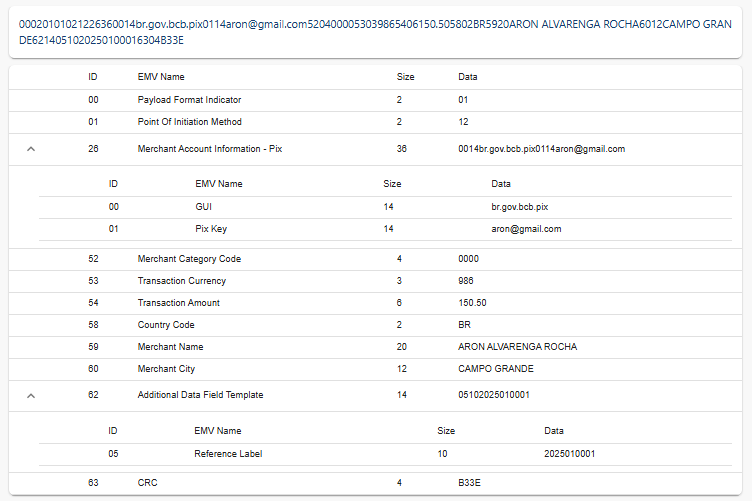
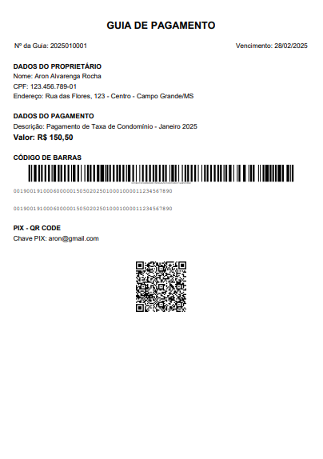

# Gerador de Guia de Pagamento

Um sistema desktop Java para geração de guias de pagamento com código de barras válido, QR Code PIX e exportação para PDF.

## 📋 Funcionalidades

- **Interface Gráfica Intuitiva**: Formulário integrado com visualização em tempo real
- **Geração Automática**:
    - Código de barras padrão FEBRABAN
    - QR Code PIX (padrão EMV)
    - Documento PDF profissional
- **Validação de Dados**: Verificação de formatos e valores
- **Pré-visualização**: Visualização completa antes da impressão/exportação
- **Exportação para PDF**:
    - Geração de documentos prontos para impressão
    - Layout otimizado para A4
    - Preserva todos os elementos (código de barras, QR Code, dados)

## 🚀 Como Executar

### Pré-requisitos
- Java 21 ou superior
- Maven 3.6 ou superior

### Passos para execução

1. **Clone ou crie o projeto**:
```bash
mkdir gerador-guia-pagamento
cd gerador-guia-pagamento
```

2. **Crie a estrutura de diretórios**:
```bash
mkdir -p src/main/java/com/aronalvarenga/gerador/model
mkdir -p src/main/java/com/aronalvarenga/gerador/service
mkdir -p src/main/java/com/aronalvarenga/gerador/ui
```

3. **Adicione os arquivos do projeto** (pom.xml e classes Java)

4. **Compile e execute**:
```bash
mvn clean compile exec:java -Dexec.mainClass="com.aronalvarenga.gerador.GeradorGuiaPagamentoApp"
```

Ou para gerar JAR executável:
```bash
mvn clean package
java -jar target/gerador-guia-pagamento-1.0-SNAPSHOT.jar
```

## 📁 Estrutura do Projeto

```
src/main/java/com/aronalvarenga/gerador/
├── GeradorGuiaPagamentoApp.java    # Aplicação principal com interface
├── model/
│   └── GuiaPagamento.java          # Modelo de dados
├── service/
│   ├── CodigoBarrasService.java    # Geração de código de barras
│   ├── PdfService.java             # Geração de PDF
│   └── PixService.java             # Geração de QR Code PIX
├── ui/
│   └── GuiaPagamentoPanel.java     # Painel de visualização da guia
└── util/
    └── BarcodeUtil.java            # Utilitário para Barcode4J
```

## 🎯 Como Usar

1. **Iniciar a aplicação**: Execute a classe principal `GeradorGuiaPagamentoApp`

2. **Preencher dados**: O sistema já vem com dados fictícios pré-preenchidos para facilitar os testes:
    - Nome do Proprietário: João da Silva Santos
    - CPF: 123.456.789-01
    - Endereço: Rua das Flores, 123 - Centro - Campo Grande/MS
    - Chave PIX: joao.silva@email.com
    - Valor: R$ 150,50
    - Descrição: Pagamento de Taxa de Condomínio - Janeiro 2025
    - Vencimento: 28/02/2025
    - Nº da Guia: 2025010001

3. **Gerar guia**: Clique no botão "Gerar Guia de Pagamento"

4. **Visualizar resultado**: A guia será exibida com:
    - Cabeçalho com número e data de vencimento
    - Dados do proprietário
    - Dados do pagamento
    - Código de barras válido (padrão FEBRABAN)
    - QR Code PIX com instruções

## 🔧 Funcionalidades Técnicas

### Código de Barras
- Segue padrão FEBRABAN de 44 dígitos
- Cálculo automático do dígito verificador (módulo 11)
- Formatação adequada para exibição
- Geração de imagem visual do código

### QR Code PIX
- Implementa padrão EMV para PIX
- Cálculo de CRC16 para validação
- Suporte a diferentes tipos de chave PIX:
    - E-mail
    - Telefone
    - CPF/CNPJ
    - Chave aleatória (UUID)

### Interface Gráfica
- Swing com Look and Feel do sistema
- Formulário organizado e intuitivo
- Scroll automático para guias grandes
- Validações de entrada em tempo real

## 📚 Dependências

- **Barcode4J**: Geração de códigos de barras Code128
- **ZXing**: Geração de QR codes PIX
- **Apache Commons Lang**: Utilitários para formatação
- **Thumbnailator**: Manipulação de imagens

### Dependência Barcode4J

O projeto utiliza a biblioteca `net.sf.barcode4j` versão 2.1 para geração dos códigos de barras. Esta biblioteca oferece excelente qualidade na geração de códigos Code128 compatíveis com o padrão bancário brasileiro.

## ⚠️ Importante

Este sistema foi desenvolvido para **fins de teste técnico** com dados fictícios. Para uso em produção, seria necessário:

- Integração com APIs bancárias reais
- Implementação de segurança adequada
- Validações mais rigorosas
- Persistência de dados
- Logs e auditoria
- Tratamento completo de erros

## 🎨 Screenshots

<div align="center">

|                                   Imagem da aplicação                                   |
|:---------------------------------------------------------------------------------------:|
|  |

| Validação do QR Code Pix. Em conformidade com o padrão EMV, contendo os campos obrigatórios como BR.GOV.BCB.PIX, identificação do beneficiário, valor e CRC para validação. |
|:---------------------------------------------------------------------------------------------------------------------------------------------------------------------------:|
|                                                                                |

|                               PDF gerado                               |
|:----------------------------------------------------------------------:|
|  |

</div>

## Novo Direcionamento
* **Validações robustas** (campos, formatos, cálculos), testes automatizados para DV/CRC.
* **Arquitetura de geração**: separar “modelo → render → export”.
* **Assinatura/segurança** (mesmo que mock): impedir alteração sem regenerar.
* **Empacotamento**: gerar instalador ou jar “one-click”.

## 📝 Licença

Este projeto foi desenvolvido para fins educacionais e de demonstração técnica.


